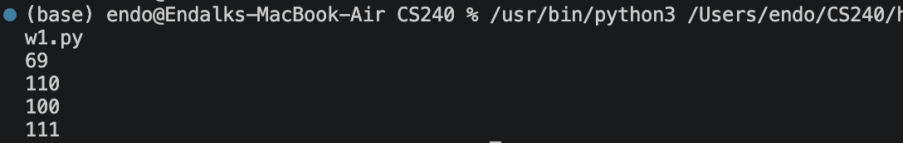

# Assignment 1 CS 240
## Task 1: ASCII-to-decimal converter
Takes a string and prints the decimal vlaue for each character using ord()

## Task 2:
Takes inputs 0, 255, and -1 to test for 0's largest unsigned number and a negative number. Conversions for to_bin(), to_oct(), to_hex() are done using built-in functions. 

## Task 3:
Takes an image as its input, and goes pixel by pixel and converts each to R/B/Y to differenciate teh different colors in the image. Converts smiley2.png to awesome_picture.txt

## Task 4:
Reads a .txt file and converts it to an image using the RGB values in the .txt value. This would make use of awesome_picture.png and return a image .

## Task 5: 
This is an add-on to Task 2. This part adds the handling of edge case values as well as two's compliments. The first two's compliment function, int_to_binary() takes a int and converts it to a binary string, if the int is negative then it will run through the if statement where it will be converted by wrapping around, then it will return a binary string. two_comp() reads binary as an int, finds the mid point and determines if it is a negative or not. If the value is negative then it will run through the if statement and return the int value along with its sign if needed.

